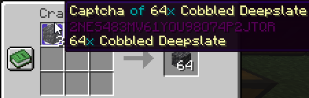
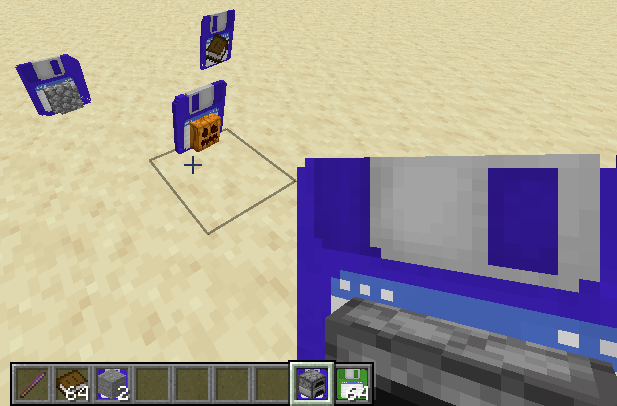

# Captchacards

Captchacards are a bulk storage solution originally written for the now-defunct Sblock server.
Captchacards are disposable items that may store up to a stack of another item.
When the item is removed, the card is destroyed. Blank cards are crafted from 2 paper.

## Storage

When a full stack of items is placed in a slot containing a blank captchacard,
a card captures the stack.
The insertion can be done either via normal click or with a hotbar key,
making for easier mass storage of other inventories.

## Retrieval

To retrieve stored items, you can either use (default right click) the item in-world
or you can place the filled card in the crafting grid.

## Resource Pack

A resource pack is generated for vanilla items. Enabling it is recommended to improve
plugin usability - it's a lot harder to find your items when they all look the same.

Custom items are not currently supported, but could theoretically be added to composites.

